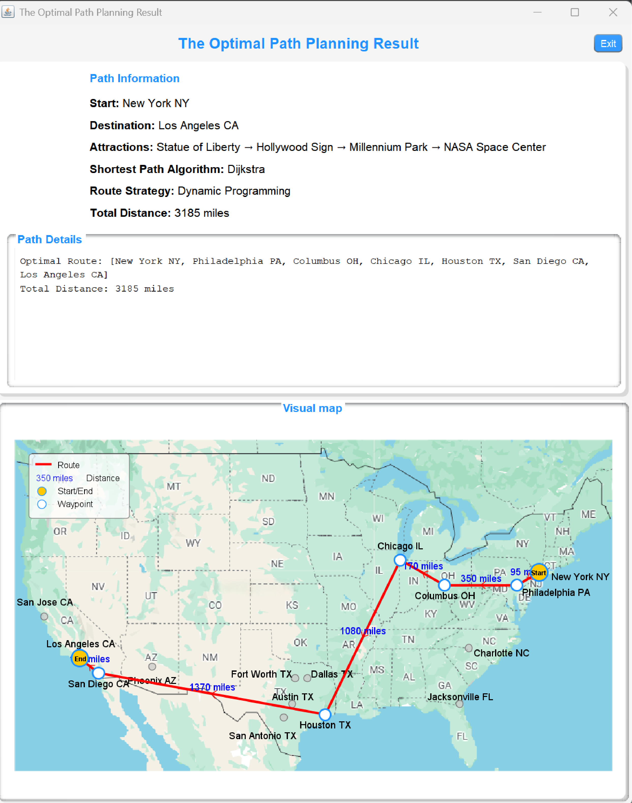
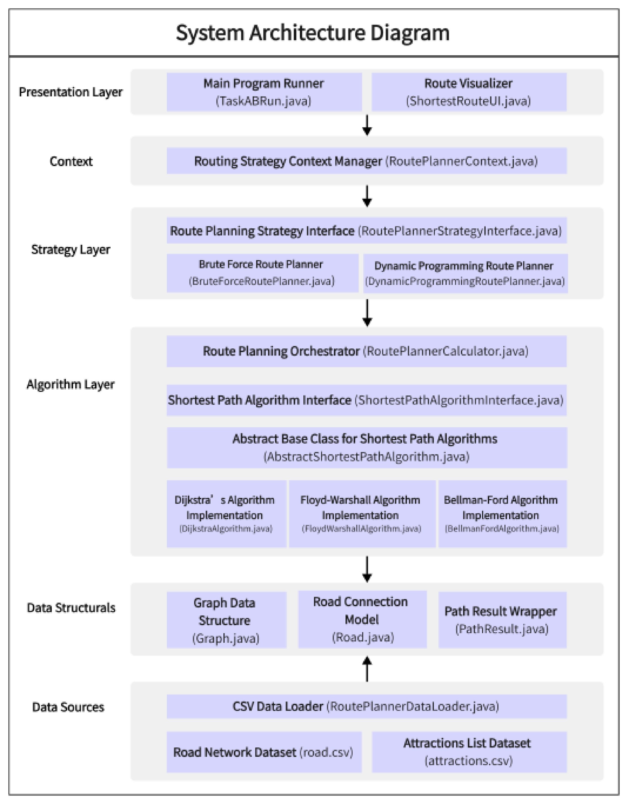
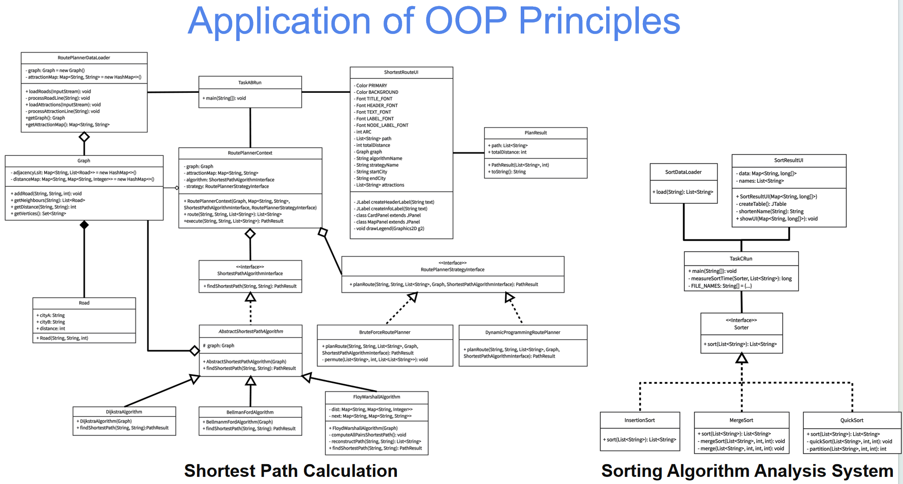

# U.S. Road Trip Route Planner

A Java-based route planning application that finds an optimized route across a U.S. road network while visiting user-selected attractions.

## Demo

<p align="center">
  
</p>

## Features

- Plan a route from an origin to a destination
- Support multiple intermediate attractions
- Automatically select suitable shortest-path algorithms
- Optimize attraction visiting order with dynamic programming
- Load road and attraction data from CSV files
- Provide both console and Java Swing interfaces
- Apply OOP principles and the Strategy Pattern

## Algorithms

The project implements three shortest-path algorithms:

- **Dijkstra**
- **Floyd-Warshall**
- **Bellman-Ford**

For multi-attraction route planning, two strategies are supported:

- **Brute Force:** `O(n! × n)`
- **Dynamic Programming:** `O(n² × 2ⁿ)`

The dynamic programming approach significantly reduces the complexity of finding an efficient attraction visiting order.

## Example

```text
Start: New York NY
Destination: Los Angeles CA

Attractions:
- Statue of Liberty
- Hollywood Sign
- Millennium Park
- NASA Space Center
```

The system maps each attraction to its city, selects an appropriate graph algorithm, optimizes the visiting order, and returns the final route.

## System Design

The application follows a layered architecture:

```text
Presentation Layer
        ↓
Context Control Layer
        ↓
Strategy Layer
        ↓
Algorithm Layer
        ↓
Data Structures Layer
        ↓
Data Sources Layer
```

<p align="center">
  
</p>

The road network is represented using adjacency lists and hash maps, while different shortest-path and route-planning implementations are connected through common interfaces.

## Object-Oriented Design

The project applies:

- Encapsulation
- Inheritance
- Polymorphism
- Abstraction
- Strategy Pattern

<p align="center">
  
</p>

## Project Structure

```text
us-road-trip-route-planner/
│
├── Context/
├── DataLoader/
├── DataStructure/
├── RouteGenerationStrategy/
├── Run/
├── ShortestPathAlgorithm/
├── SortingAlgorithm/
│
├── attractions.csv
├── roads.csv
│
├── images/
│   ├── route-planning-demo.png
│   ├── route-result.png
│   ├── system-architecture.png
│   └── class-diagram.png
│
└── README.md
```

## Tech Stack

- Java
- Swing
- Graph Algorithms
- Dynamic Programming
- Object-Oriented Programming
- Strategy Pattern
- CSV Data Processing

## Complexity

| Algorithm / Strategy | Time Complexity |
|---|---:|
| Dijkstra | `O((V + E) log V)` |
| Floyd-Warshall | `O(V³)` |
| Bellman-Ford | `O(V × E)` |
| Brute Force | `O(n! × n)` |
| Dynamic Programming | `O(n² × 2ⁿ)` |

## Team Project

Developed as a CPT204 team software engineering project at Xi'an Jiaotong-Liverpool University.
